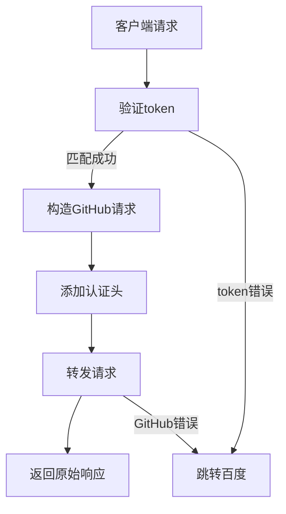

# cf49raw 代理服务文档

## 项目介绍

这是一个基于 Cloudflare Workers 构建的 GitHub 原始文件代理服务，通过添加双重身份验证机制实现私有仓库文件的安全访问。服务采用 Serverless 架构，具备自动扩展能力。

## 核心功能

1. **GitHub 原始文件代理**

   - 自动将请求路径转换为 `raw.githubusercontent.com` 地址
   - 支持完整的 GitHub 文件访问功能
   - 保持原始响应内容和状态码

2. **双层身份验证**

   - 客户端验证：通过 URL 参数 `nine-token` 进行用户身份校验
   - 服务端验证：使用 GitHub Personal Access Token 进行后端认证
   - 不匹配时强制跳转百度（状态码 302）

3. **智能错误处理**
   - 自动捕获所有异常（网络错误/超时/认证失败）
   - GitHub 请求失败时返回标准错误状态码
   - 统一异常跳转策略保障安全性

## 部署指南

### 1. 复制代码

将 [cf49raw.js](./cf49raw.js) 复制到 Cloudflare Workers 中即可

### 2. 配置参数

在 Cloudflare Dashboard > Workers > Variables 中设置：

- `GITHUB49TOKEN`：GitHub Personal Access Token
- `NINE49TOKEN`：自定义代理访问令牌（建议使用 UUID）

## 使用说明

### 请求格式

```http
GET https://<worker-domain>/:path?nine-token=<access_token>
```

**示例请求**：

```bash
curl "https://example.com/Nine499/cf49raw/main/README.md?nine-token=your_token"
```

### 响应流程



## 安全策略

1. **令牌管理**

   - 建议定期轮换 `NINE49TOKEN`
   - GitHub Token 应设置最小权限原则
   - 禁止在客户端存储长期有效的 token

2. **访问控制**
   - 建议配合 Cloudflare Access 实现更细粒度控制
   - 可通过 Workers Analytics 监控异常请求模式

## 常见问题

### 403 Forbidden

- 检查 GitHub Token 是否过期
- 确认仓库路径是否正确（需完整包含用户名/仓库/分支）
- 验证 Cloudflare 环境变量是否生效

### 429 Too Many Requests

- 触发 GitHub API 限速（未认证用户 60 次/小时）
- 建议升级 GitHub Pro 账户获取更高配额

## 代码结构解析

```javascript
export default {
  async fetch(request, env) {
    // 1. URL 解析模块
    const url = new URL(request.url);

    // 2. 认证验证模块
    if (userToken !== env.NINE49TOKEN) {...}

    // 3. 请求代理模块
    const githubRawUrl = `https://raw.githubusercontent.com${path}`;

    // 4. 响应处理模块
    return await fetch(githubRawUrl, { headers });
  }
}
```

## 许可证

MIT License

Copyright (c) 2025 Nine499

特此授权，任何人可复制、修改本作品，需保留版权声明及变更说明。
